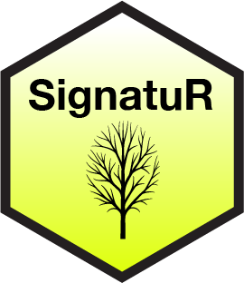

# SignatuR

An R package to store and interact with gene signatures for single-cell analysis

<p align="center">
  
</p>


## Install
Get the database and its accessor functions:
```
remotes::install_github("carmonalab/SignatuR")
library(SignatuR)
```

## Data format

The DB is structured as a [data.tree](https://cran.r-project.org/web/packages/data.tree/vignettes/data.tree.html) object, with signatures organized by species and category.
Gene lists are stored in the "Signature" attribute, comments and references for the signature are stored in the "Reference" attribute.

Several functions for easy interaction with the data structure have been implemented. See some examples below:


* See database structure
```r
SignatuR
```

* See database with annotations
```r
print(SignatuR, "Reference","Signature")
```

* Plot database structure (requires installing `DiagrammeR`)
```r
library(DiagrammeR)
plot(SignatuR)
```

* Extract a specific signature
```r
s <- GetSignature(SignatuR$Mm$Programs$HeatShock)
```

* Extract all signatures below a given node
```r
ss <- GetSignature(SignatuR$Mm$Programs)
```

* Add a new signature to the DB (e.g. to "Cell_types" node)
```r
SignatuR <- AddSignature(SignatuR,
	node=SignatuR$Mm$Cell_types,
	name="T_cell",
	reference="A simple T cell signature",
	signature=c("Cd2","Cd3d","Cd3e"))
```

* Modify and existing signature (turn on 'overwrite' flag)
```r
SignatuR <- AddSignature(SignatuR,
	node=SignatuR$Mm$Cell_types,
	name="T_cell",
	reference="A modified T cell signature",
	signature=c("Cd2","Cd3d","Cd3e","Cd3g"),
	overwrite=T)
```

* Add a new node to the DB
```r
SignatuR <- AddNode(SignatuR,
  parent_node=SignatuR$Hs,
  name="New_category")
```

* Remove a signature or a node from the DB
```r
RemoveSignature(SignatuR$Hs$Compartments$TCR)
```

* Make a clone of the DB (allows you to edit without breaking the DB)
```r
SignatuR.copy <- data.tree::Clone(SignatuR)
```

* Save a local copy of your modified SignatuR DB
```r
SaveSignatuR(SignatuR, file="mySignatuR.csv")
```

* Load a local copy of SignatuR from disk
```r
mySignatuR <- LoadSignatuR("mySignatuR.csv")
```


* Save updated database (for package developers)
```r
usethis::use_data(SignatuR, overwrite = TRUE)
```

## Use examples

* In gene feature selection for [data integration](https://carmonalab.github.io/STACAS.demo/STACAS.demo.html#important-notes)


<p align="center">
  
</p>


